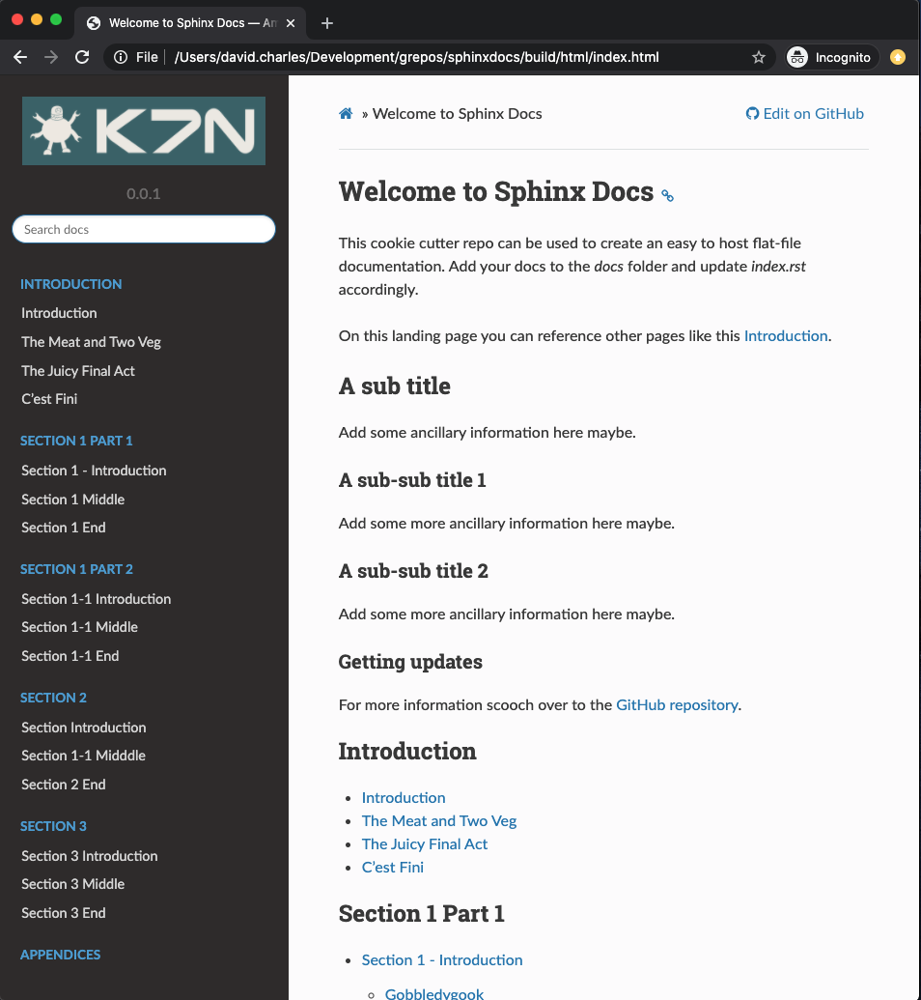

# Sphinx Docs

This cookie cutter repo can be used to create an easy to host flat-file
documentation site using
[Markdown](https://www.markdownguide.org/getting-started/) files
(Markdown supported through the
[recommonmark](https://recommonmark.readthedocs.io) extension).
The documents are built using [Sphinx](https://www.sphinx-doc.org/en/master) and
the [Read the Docs](https://sphinx-rtd-theme.readthedocs.io) theme.



## Getting Started

Clone the repo:

```bash
$ git clone git@github.com:davecharles/sphinxdocs.git
$ cd sphinxdocs
```

### Docker Compose

Using docker-compose is recommended to get started quickly.

```bash
$ make compose-build
$ make compose-up    # run detached
$ make compose-down  # for when you're done
```

Once up, navigate a browser to `http://localhost:8000`. Edit markdown
documents as required. Refresh browser to view an automatically regenerated
build.

The `docker-compose.yml` specifies two services:

- `doc-nginx` to host the documentation set.
- `doc-sphinx` that invokes `make watch` which uses the
  [inotify-tools](https://github.com/inotify-tools/inotify-tools/wiki)
  `inotifywait` to detect source changes so a re-build can be invoked. This
   means you can update the source without restarting the services.

### Building locally
You'll need a suitable Python environment with the dependencies defined in
`requirements.txt` installed. Run `make` with no args to see a complete list
of project and Sphinx targets.

```bash
$ make
== Targets =========================================================
Use make with one of the following general targets:
clean                      - Clean generated build files
compose-build              - Build docker compose services
compose-up                 - Bring up services
compose-down               - Shutdown services

== Sphinx specific targets =========================================
Use make with one of the following SPHINX targets:
Sphinx v3.1.1
Please use `make target' where target is one of
  html        to make standalone HTML files
  dirhtml     to make HTML files named index.html in directories
  singlehtml  to make a single large HTML file
  pickle      to make pickle files
  json        to make JSON files
  htmlhelp    to make HTML files and an HTML help project
  qthelp      to make HTML files and a qthelp project
  devhelp     to make HTML files and a Devhelp project
  epub        to make an epub
  latex       to make LaTeX files, you can set PAPER=a4 or PAPER=letter
  latexpdf    to make LaTeX and PDF files (default pdflatex)
  latexpdfja  to make LaTeX files and run them through platex/dvipdfmx
  text        to make text files
  man         to make manual pages
  texinfo     to make Texinfo files
  info        to make Texinfo files and run them through makeinfo
  gettext     to make PO message catalogs
  changes     to make an overview of all changed/added/deprecated items
  xml         to make Docutils-native XML files
  pseudoxml   to make pseudoxml-XML files for display purposes
  linkcheck   to check all external links for integrity
  doctest     to run all doctests embedded in the documentation (if enabled)
  coverage    to run coverage check of the documentation (if enabled)
```

#### Build HTML
```bash
$ make html
```
This publishes the documentation set to `build/html`. Navigate a browser to
`file:///<path-to-repo-folder>/build/html/index.html`.

#### Build Man Pages
```bash
$ make man
```
This publishes the man pages to `build/man`. In a terminal enter:

```bash
$ man <path-to-repo-folder>/build/man/Amaze-Docs-docs.1
```

## To Do

- Add multiple man pages i.e. for each "chapter"
- Make tooling to install man pages
